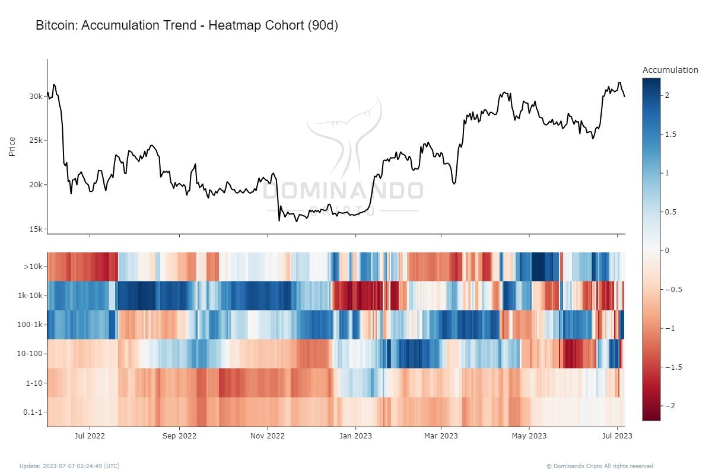

# Tendência de Acumulação (Heatmap)

O Indicador de Tendência de Acumulação - Heatmap Cohort é uma ferramenta altamente eficaz para analisar a dinâmica de acumulação e distribuição do Bitcoin em vários níveis de carteiras. Desenvolvido pela Dominando Cripto, esse indicador oferece uma visão poderosa das atividades de compra e venda relacionadas à criptomoeda.

O Heatmap Cohort utiliza um mapa de calor para visualizar os padrões de acumulação e distribuição do Bitcoin. Com sua ajuda, os investidores e traders podem identificar áreas onde ocorrem movimentos significativos de compra ou venda em diferentes faixas de preço. Essa abordagem possibilita a identificação de tendências de acumulação ou distribuição, permitindo decisões mais fundamentadas.

Ao aplicar o Indicador de Tendência de Acumulação - Heatmap Cohort, é possível avaliar a pressão de compra e venda em diversos níveis de preço. Essa análise revela áreas de suporte e resistência cruciais no mercado. Adicionalmente, o indicador auxilia na identificação de grandes players e em compreender suas estratégias de negociação.

É importante enfatizar que o uso desse indicador deve ser complementado por outras análises e indicadores técnicos para uma visão completa do mercado. Além disso, é essencial ter conhecimento dos fundamentos do Bitcoin e acompanhar notícias e eventos relevantes para embasar as decisões.

Em resumo, o Indicador de Tendência de Acumulação - Heatmap Cohort é uma ferramenta valiosa para analisar a dinâmica de acumulação e distribuição do Bitcoin. Com sua capacidade de fornecer insights sobre as atividades de compra e venda em diferentes faixas de preço, os investidores podem tomar decisões mais informadas e identificar tendências significativas no mercado de Bitcoin. Ao incorporar esse indicador em sua estratégia, você estará melhor posicionado para alcançar resultados sólidos em suas atividades de negociação de criptomoedas.
