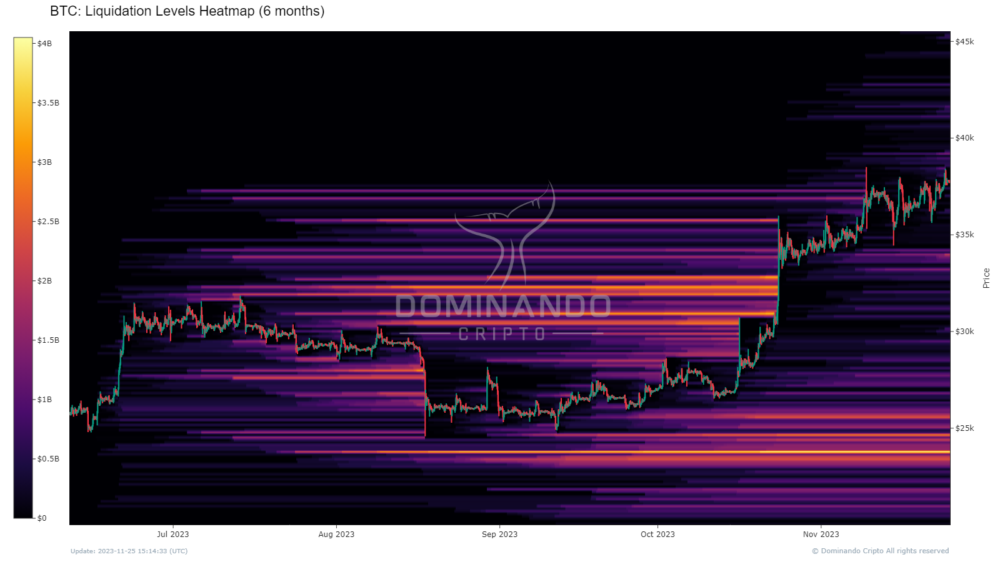

# Níveis de Liquidação: Mapa de Calor

## O que é?

Para compreender o indicador Níveis de Liquidação: Mapa de Calor, é essencial entender em primeiro lugar, o que são liquidações.

Liquidações representam um evento no qual a corretora encerra a posição de um trader devido à falta de margem suficiente para manter a posição aberta. Em outras palavras, quando um trader não possui fundos adequados para cobrir suas operações, a corretora toma a decisão de fechar a posição automaticamente.

O indicador Liquidation Levels Heatmap é uma ferramenta que pode ser usada para identificar áreas onde um grande número de traders pode ser liquidado. Ele estima estima níveis de liquidação ao analisar o comportamento de alavancagem dos traders. No gráfico, o níveis de liquidação estimados são adicionados ao seu respectivo intervalo de preço. Cores fortes em um intervalo de preço indicam grandes zonas de liquidação.

## Como usar?

Grandes concentrações de liquidações, marcadas por zonas com cores fortes no mapa de calor, podem ser usados como zonas de suporte e resistência, visto que grandes players podem se beneficar das oportunidades criadas por grandes eventos de liquidação.de eventos de liquidação.

Além disso, essas grandes concentrações de liquidações podem agir como zonas magnéticas e muitas vezes atrair o preço em sua direção.

