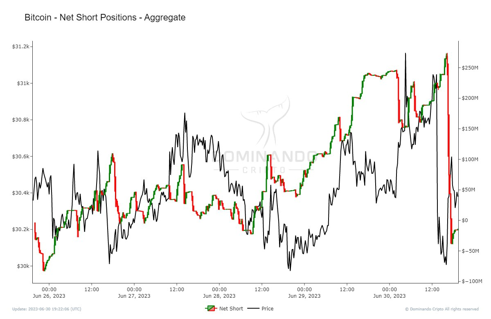

# Net Positions

O "Indicador Net Positions" é uma ferramenta altamente relevante para analisar as posições líquidas de derivativos de Bitcoin. Desenvolvido para fornecer uma visão abrangente das posições de contratos futuros, opções e outros instrumentos derivativos relacionados ao Bitcoin, esse indicador oferece insights valiosos sobre a atividade de negociação nesses mercados.

Com o auxílio do "Net Positions", investidores e traders podem obter informações precisas sobre o sentimento do mercado em relação ao Bitcoin. O indicador permite identificar o saldo líquido das posições em aberto, ajudando a compreender se há uma maior predominância de posições longas (compra) ou curtas (venda) no mercado de derivativos do Bitcoin.

Ao avaliar as posições líquidas de derivativos do Bitcoin, é possível identificar tendências emergentes e potenciais movimentos de preços significativos. Essa análise autoritativa permite que os investidores tomem decisões embasadas e informadas com base nas informações sobre as posições do mercado.

Em resumo, o "Net Positions" é uma ferramenta importante para analisar as posições líquidas de derivativos de Bitcoin. Com seu estilo objetivo, educacional e autoritativo, os investidores podem obter insights valiosos sobre a atividade de negociação e tomar decisões mais informadas no mercado de derivativos do Bitcoin. Ao incorporar esse indicador em sua estratégia de investimento, você estará melhor preparado para alcançar resultados sólidos em suas atividades de negociação de criptomoedas.
