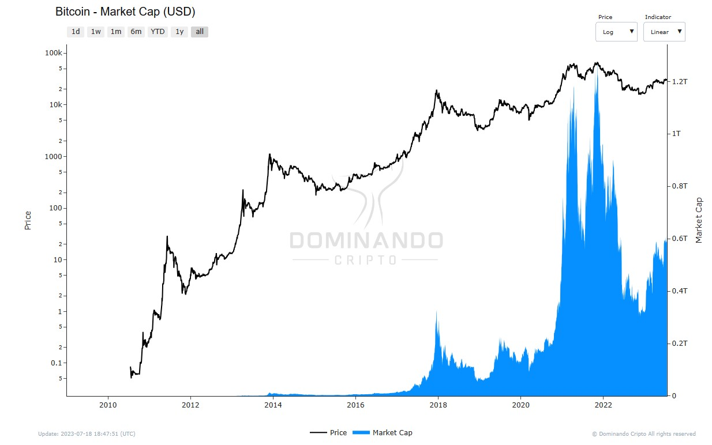

---
title:
description:
date: 2022-07-20
image:
---

## Capitalização de Mercado

A capitalização de mercado é um dos principais indicadores utilizados no mundo das criptomoedas para mensurar o valor e a relevância de uma moeda ou token específico no mercado. Essa métrica é calculada multiplicando o número total de moedas que já foram mineradas ou emitidas pela criptomoeda, pelo preço atual de cada unidade.

  

<h2>$\Large{Market Cap} = {\normalsize  Total\space Supply}\times{\normalsize Current\space Price}$</h2>

Essa medida oferece aos investidores e entusiastas uma visão mais completa e comparativa sobre o posicionamento das criptomoedas em relação umas às outras. Ao contrário do preço isolado de uma moeda, que pode ser volátil e não fornecer um panorama completo, a capitalização de mercado leva em conta tanto o preço quanto a quantidade total de moedas em circulação.

O valor da capitalização de mercado pode ser interpretado como um indicativo da estabilidade e relevância de um ativo digital. Por exemplo, mesmo que uma criptomoeda tenha um preço alto por unidade, se sua capitalização de mercado for relativamente baixa, ela pode ser mais suscetível a oscilações de preços e impactos significativos do mercado. Por outro lado, uma criptomoeda com uma capitalização de mercado maior tende a ser mais estável e resiliente a mudanças bruscas nas condições do mercado.

