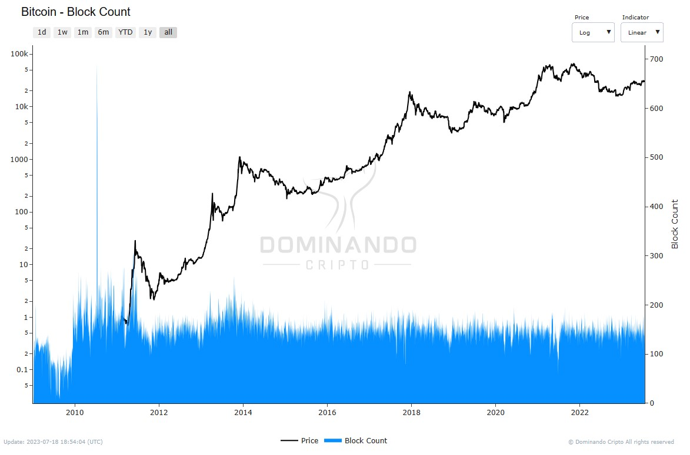

# Number of Blocks

The indicator represents the total count of blocks created (mined) during a given time interval that were included in the main chain of a blockchain blockchain.

Although Bitcoin is designed to mine approximately 144 blocks per day, it is rare for this target to be accurately achieved. This is mainly due to variations in the network hashrate, which causes the actual number of mined blocks to vary over time.

<figcaption align="center" style={{ fontSize: "12px", color: "#B0B0B0 " }}>
  Fig.1 - Number of Blocks
</figcaption>
