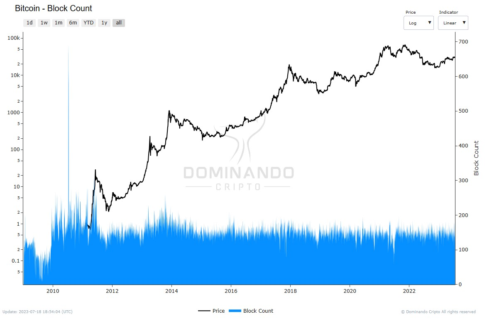

# Número de Blocos

O indicador representa a contagem total de blocos criados (minerados) durante um determinado intervalo de tempo que foram incluídos na cadeia principal de uma blockchain blockchain.

Embora o Bitcoin tenha sido projetado para minerar aproximadamente 144 blocos por dia, é raro que essa meta seja alcançada com precisão. Isso ocorre principalmente devido às variações no hashrate da rede, o que faz com que o número real de blocos minerados varie ao longo do tempo.

<figcaption align="center" style={{ fontSize: "12px", color: "#B0B0B0 " }}>
  Fig.1 - Número de Blocos
</figcaption>
