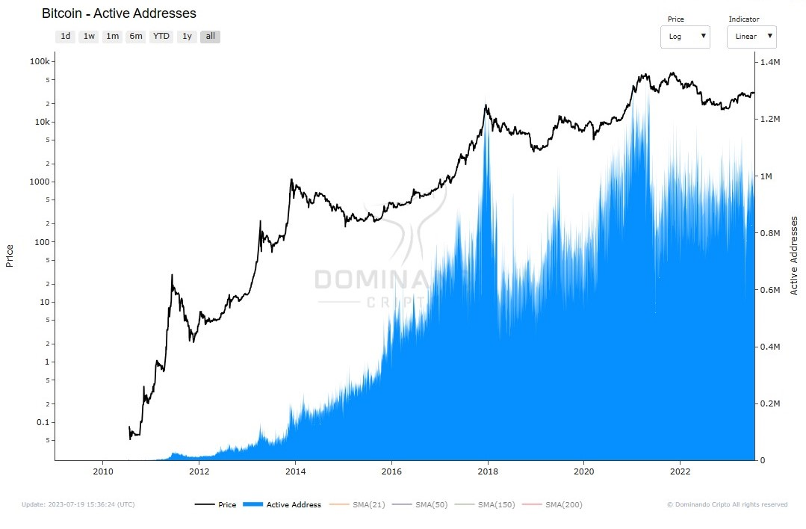

# Tamanho Médio dos Blocos

O tamanho médio dos blocos, medido em bytes, indica a quantidade de dados que está sendo processada e adicionada à cadeia em um determinado período.

A média do tamanho dos blocos pode variar ao longo do tempo, dependendo da quantidade de transações realizadas na rede em um determinado dia. Em dias de alta atividade, quando muitas transações são realizadas, é esperado que o tamanho médio dos blocos também aumente. Por outro lado, em dias de menor atividade, o tamanho médio dos blocos pode ser menor.

Esse é um indicador importante para os desenvolvedores e mantenedores da rede, pois eles podem avaliar a eficiência e a capacidade da blockchain em lidar com a crescente demanda de transações. Monitorar a média do tamanho dos blocos é fundamental para garantir que a rede continue funcionando de maneira eficiente e que possíveis gargalos sejam identificados e solucionados a tempo.

<figcaption align="center" style={{ fontSize: "12px", color: "#B0B0B0 " }}>
  Fig.1 - Tamanho de Bloco (bytes)
</figcaption>
