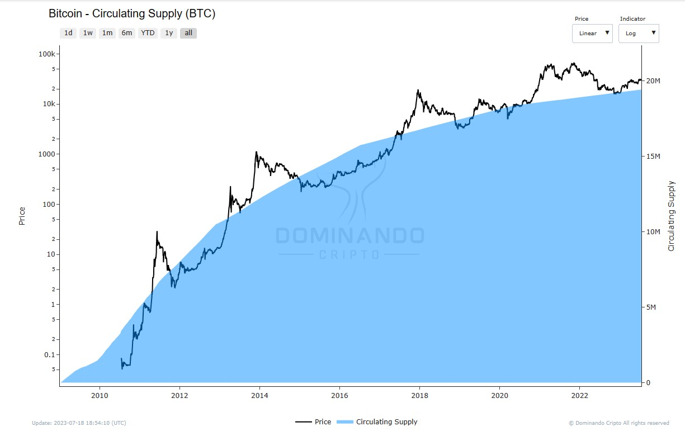

# Supply Circulante

## O que é:

O conceito de Supply Circulante refere-se à quantidade de moedas ou tokens de uma criptomoeda que estão atualmente disponíveis e em circulação no mercado. Em outras palavras, é a quantidade de criptomoedas que estão nas mãos dos investidores, traders e usuários em geral, prontas para serem compradas, vendidas ou utilizadas em transações.

### Como é calculado:

O cálculo do Supply Circulante é relativamente simples. Para obter esse valor, basta somar todas as moedas que foram emitidas e estão em circulação, excluindo aquelas que estão temporariamente retidas ou "travadas" por meio de contratos inteligentes ou outras formas de custódia. Apenas as moedas que estão livremente disponíveis no mercado são contabilizadas nessa métrica.

## Como usar:

O indicador de Supply Circulante oferece insights cruciais para investidores, traders e entusiastas de criptomoedas. Ele auxilia esses agentes a compreender a dinâmica do mercado e a avaliar o potencial de crescimento de uma determinada criptomoeda com base na sua disponibilidade e utilidade. Algumas formas de uso incluem:

**1. Avaliação da liquidez:** O Supply Circulante ajuda a entender a quantidade de moedas disponíveis para negociação, o que pode influenciar a liquidez da criptomoeda. Maior liquidez geralmente significa que é mais fácil comprar e vender a criptomoeda sem causar grandes flutuações nos preços.

**2. Cálculo da capitalização de mercado:** A "circulating supply" é um fator essencial para calcular a capitalização de mercado de uma criptomoeda. Multiplicando o preço atual da moeda pelo número de unidades em circulação, obtém-se a capitalização de mercado. Essa métrica é amplamente utilizada para comparar o tamanho relativo das diferentes criptomoedas no mercado.

**3. Análise comparativa:** Comparar o Supply Circulante de diferentes criptomoedas permite entender o quão amplamente distribuídas estão no mercado. Isso pode ser um indicativo do interesse e adoção da criptomoeda por parte dos usuários.

<figcaption align="center" style={{ fontSize: "12px", color: "#B0B0B0 " }}>
  Fig.1 - Supply Circulante (BTC)
</figcaption>
