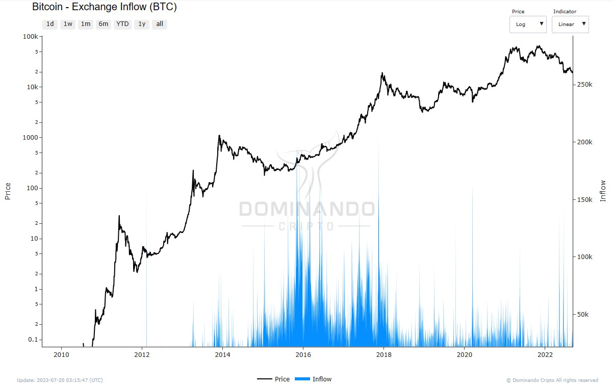

# Fluxo de Entrada/Saída em Exchanges

## O que é?

O fluxo de entrada / saída em exchanges refere-se à movimentação de moedas ou tokens entre carteiras de exchanges e as carteiras de outros usuários:

1. **Fluxo de entrada (Exchange Inflow)**: Quantidade de moedas ou tokens transferidos para as carteiras das exchanges.

2. **Fluxo de saída (Exchange Outflow)**: Quantidade de moedas ou tokens transferidos das carteiras das exchanges para as carteiras de outros usuários.

## Como é calculado?

O cálculo do fluxo de entrada / saída em exchanges é realizado por meio da análise das transações de movimentação de moedas ou tokens entre as carteiras das exchanges e as carteiras dos usuários. O fluxo de entrada é calculado a partir do número de moedas que entraram nas exchanges, e o fluxo de saída refe-re à quantia que está saindo das exchanges.

## Como usar?

O fluxo de entrada / saída em exchanges pode fornecer insights importantes sobre a pressão de compra e venda no mercado de criptoativos. Aqui estão algumas interpretações possíveis:

1. **Fluxo de entrada superior ao fluxo de saída**: Quando o fluxo de entrada para as exchanges é maior do que o fluxo de saída, isso pode indicar uma pressão de venda no mercado. Investidores podem estar enviando suas moedas para as exchanges com o propósito de vendê-las, o que pode levar a uma queda nos preços. Isso é comumente interpretado como um sinal de baixa (Bearish).

2. **Fluxo de saída superior ao fluxo de entrada**: Se o fluxo de saída das exchanges é maior do que o fluxo de entrada, isso pode indicar uma pressão de compra no mercado. Os investidores podem estar retirando suas moedas das exchanges para guardá-las em suas próprias carteiras, o que pode levar a um aumento nos preços. Isso é geralmente interpretado como um sinal de alta (Bullish).

3. **Tendência de fluxo de entrada / saída**: Observar a tendência do fluxo de entrada ou saída ao longo do tempo pode ajudar a prever a volatilidade do mercado e identificar possíveis pontos de inflexão (topos ou fundos) nos preços das criptomoedas.

4. **Comparação com médias móveis**: A média móvel do fluxo de entrada e do fluxo de saída pode ser usada para analisar o comportamento histórico dos investidores em relação ao mercado. Isso pode ajudar a identificar padrões e possíveis tendências futuras.

Em resumo, o fluxo de entrada / saída em exchanges é uma métrica importante para os investidores avaliarem a dinâmica do mercado e tomar decisões informadas sobre suas estratégias de investimento.

  

<figcaption align="center" style={{ fontSize: "12px", color: "#B0B0B0 " }}>
  Fig.1 - Depósitos em Corretoras (BTC)
</figcaption>
