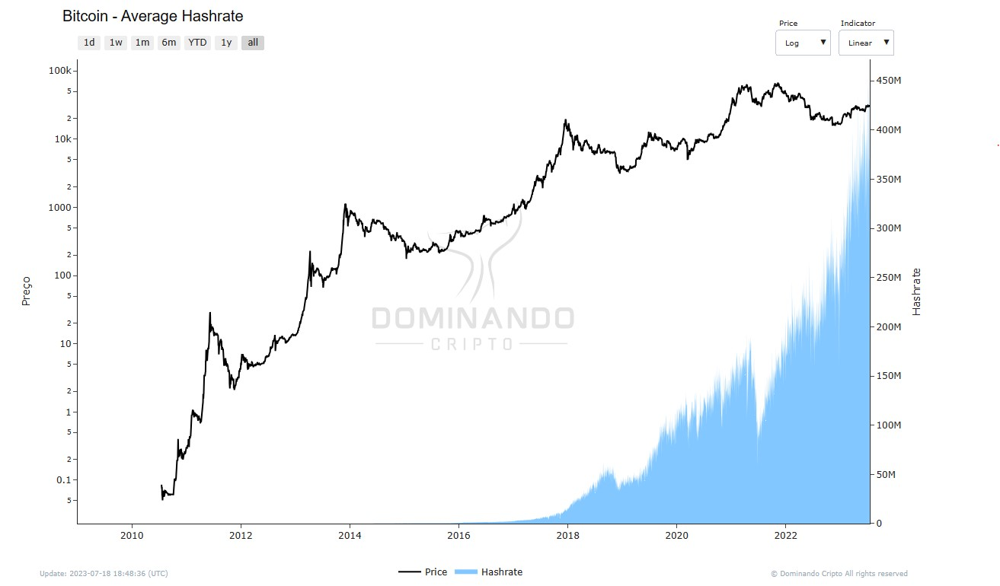

# Hashrate

## What is it?

Hashrate is a measure of processing power dedicated to Bitcoin mining. In simple terms, it represents the total computational power of the network. Mining cryptocurrencies such as Bitcoin involves solving complex mathematical problems, generating unique "hashes" that verify and ensure the security of transactions on the network.

At Dominando Cripto, we offer the "Average Hashrate" indicator, which represents the average rate at which miners are solving hashes over a period of one day. The Average Hashrate measures the speed at which calculations are being completed across all miners on the network. The unit of measurement varies depending on the protocol used.

## How is it calculated?

The hashrate is calculated by measuring the number of hashes that can be executed per second by all miners connected to the network. A "hash" is the result of a unique mathematical operation, and miners compete with each other to find the correct hash that validates a new block of transactions. The faster a miner can perform these operations, the higher its hashrate.

Hashrate is usually expressed in units such as hashes per second (H/s), kilohashes per second (kH/s), megahashes per second (MH/s), gigahashes per second (GH/s), terahashes per second (TH/ s) and exahashes per second (EH/s). In the case of Bitcoin, it is common to use terahashes per second (TH/s), but other cryptocurrencies may use different units.

## How to use?

Hashrate is an important metric for evaluating the performance and security of the Bitcoin network. A high hashrate makes the network more secure as it is more difficult for malicious individuals to carry out attacks known as "51% attacks". These attacks occur when a malicious entity controls more than half of the total network hashrate, allowing it to take control and manipulate transactions.

Furthermore, the hashrate, including the Average Hashrate, can be used to predict the mining difficulty in the future and estimate the profitability of Bitcoin mining. However, it is important to remember that mining profitability also depends on other factors such as Bitcoin price, electricity cost and transaction rewards.

<figcaption align="center" style={{ fontSize: "12px", color: "#B0B0B0 " }}>
  Fig.1 - Average Hashrate (TH/s)
</figcaption>
