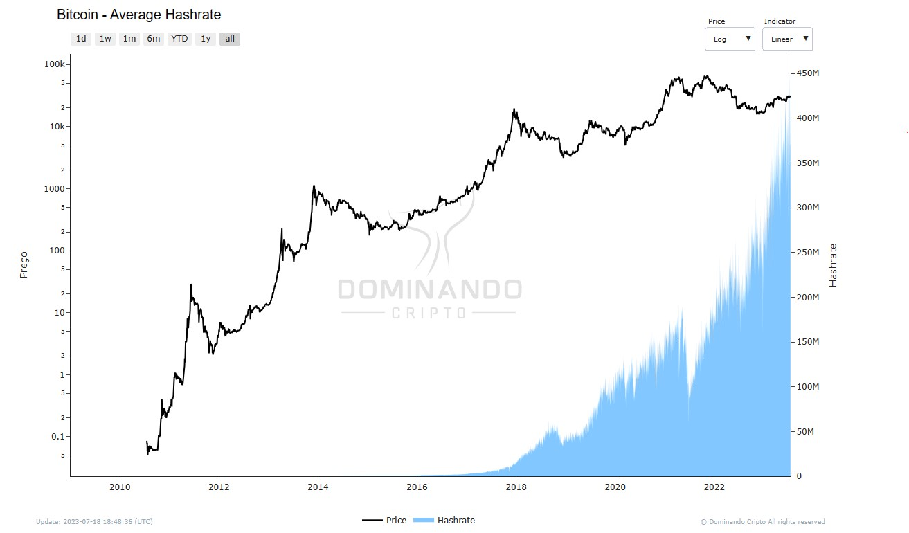

# Hashrate

## O que é?

Hashrate é uma medida da potência de processamento dedicada à mineração de Bitcoin. Em termos simples, ele representa o poder computacional total da rede. A mineração de criptomoedas, como o Bitcoin, envolve a resolução de problemas matemáticos complexos, gerando "hashes" únicos que verificam e garantem a segurança das transações na rede.

Na Dominando Cripto, oferecemos o indicador "Average Hashrate", que representa a média da taxa com que os mineradores estão resolvendo hashes em um período de um dia. O Average Hashrate mede a velocidade em que os cálculos estão sendo concluídos em todos os mineradores da rede. A unidade de medida varia dependendo do protocolo utilizado.

## Como é calculado?

O hashrate é calculado medindo a quantidade de hashes que podem ser executados por segundo por todos os mineradores conectados à rede. Um "hash" é o resultado de uma operação matemática única, e os mineradores competem entre si para encontrar o hash correto que valide um novo bloco de transações. Quanto mais rápido um minerador pode executar essas operações, maior é o seu hashrate.

O hashrate é geralmente expresso em unidades como hashes por segundo (H/s), kilohashes por segundo (kH/s), megahashes por segundo (MH/s), gigahashes por segundo (GH/s), terahashes por segundo (TH/s) e exahashes por segundo (EH/s). No caso do Bitcoin, é comum utilizar a unidade terahashes por segundo (TH/s), mas outras criptomoedas podem utilizar diferentes unidades.

## Como usar?

O hashrate é uma métrica importante para avaliar o desempenho e a segurança da rede Bitcoin. Um hashrate elevado torna a rede mais segura, pois é mais difícil para indivíduos mal-intencionados realizarem ataques conhecidos como "ataques de 51%". Esses ataques ocorrem quando uma entidade mal-intencionada controla mais da metade do hashrate total da rede, permitindo que ela tome controle e manipule as transações.

Além disso, o hashrate, incluindo o Average Hashrate, pode ser utilizado para prever a dificuldade da mineração no futuro e estimar a lucratividade da mineração de Bitcoin. No entanto, é importante lembrar que a lucratividade da mineração também depende de outros fatores, como o preço do Bitcoin, o custo da eletricidade e as recompensas das transações.

<figcaption align="center" style={{ fontSize: "12px", color: "#B0B0B0 " }}>
  Fig.1 - Average Hashrate (TH/s)
</figcaption>
