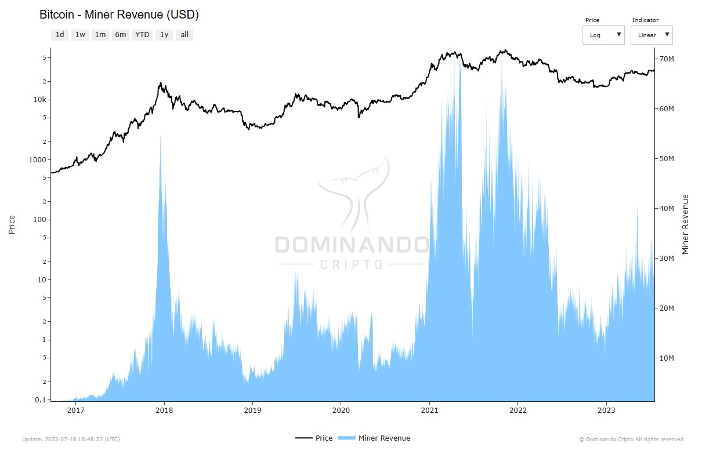

# Income from Miners

## What is it?

Miner Income is a cryptocurrency indicator that measures the amount of money miners earn from two sources:

1. Transaction fees
2. Mining rewards

Transaction fees are earned when a miner successfully validates a block, and all fees associated with transactions in that block are passed on to the responsible miner.

In addition, miners also receive mining rewards, usually in the form of new bitcoins, as compensation for their work in the validation process.

## How is it calculated?

The indicator is calculated with the sum of transaction fees and mining activity rewards:

  

   <h2>$\Large{Miner\space Revenue} = \normalsize Transaction\space Fees+Mining\space Rewards$</h2>

## How to use?

By expressing Miner Income in the network's native currency, such as BTC (on the Bitcoin network), it is possible to clearly visualize the effect of the cryptocurrency's monetary policies. In the case of Bitcoin, miners' revenue decreases staggeringly due to halvings, which occur approximately every four years and halve the reward of mined blocks.

When analyzed in dollars, Miners' Revenue tends to reach highs at market tops and lows at market bottoms. Observing the graph (Fig.1) below, it is possible to conclude that Miners' Revenue at historical highs generally signals favorable moments for sales, while Miners' Revenue at historical lows indicates opportune moments for purchases.

Taking this information into account, traders can benefit from selling during the tops and buying during the bottoms of the indicator, taking advantage of the best entry and exit points in the market.

  

<figcaption align="center" style={{ fontSize: "12px", color: "#B0B0B0 " }}>
  Fig.1 - Miners' Revenue (USD)
</figcaption>
