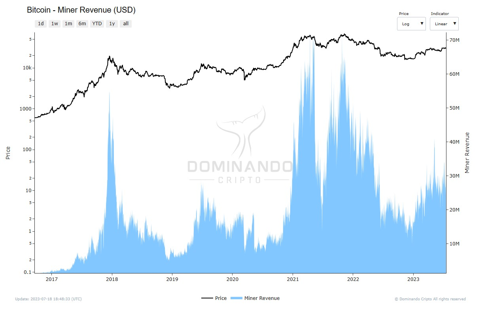

# Receita dos Mineradores

## O que é?

A Receita dos Mineradores é um indicador de criptomoedas que mede a quantidade de dinheiro que os mineradores ganham de duas fontes:

1. Taxas de transação
2. Recompensas de mineração

As taxas de transação são recebidas quando um minerador valida com sucesso um bloco, e todas as taxas associadas às transações nesse bloco são repassadas ao minerador responsável.

Além disso, os mineradores também recebem recompensas de mineração, geralmente em forma de novos bitcoins, como uma compensação pelo seu trabalho no processo de validação.

## Como é calculada?

O indicador é calculado com a soma das taxas de transação e as recompensas da atividade de mineração:

  

  <h2>$\Large{Miner\space Revenue} = \normalsize Transaction\space Fees+Mining\space Rewards$</h2>

## Como usar?

Ao expressar a Receita dos Mineradores na moeda nativa da rede, como BTC (na rede do Bitcoin), é possível visualizar claramente o efeito das políticas monetárias da criptomoeda. No caso do Bitcoin, a receita dos mineradores diminui de forma escalonada devido aos halvings, que ocorrem aproximadamente a cada quatro anos e reduzem pela metade a recompensa dos blocos minerados.

Quando analisada em dólar, a Receita dos Mineradores tende a atingir altas nos topos de mercado e baixas nos fundos de mercado. Observando o gráfico (Fig.1) abaixo, é possível concluir que a Receita dos Mineradores em topos históricos geralmente sinaliza momentos propícios para vendas, enquanto a Receita dos Mineradores em baixas históricas indica momentos oportunos para compras.

Tomando tais informações em consideração, os investidores podem se beneficiar ao vender durante os topos e comprar durante os fundos do indicador, aproveitando os melhores pontos de entrada e saída no mercado.

  

<figcaption align="center" style={{ fontSize: "12px", color: "#B0B0B0 " }}>
  Fig.1 - Receita dos Mineradores (USD)
</figcaption>
