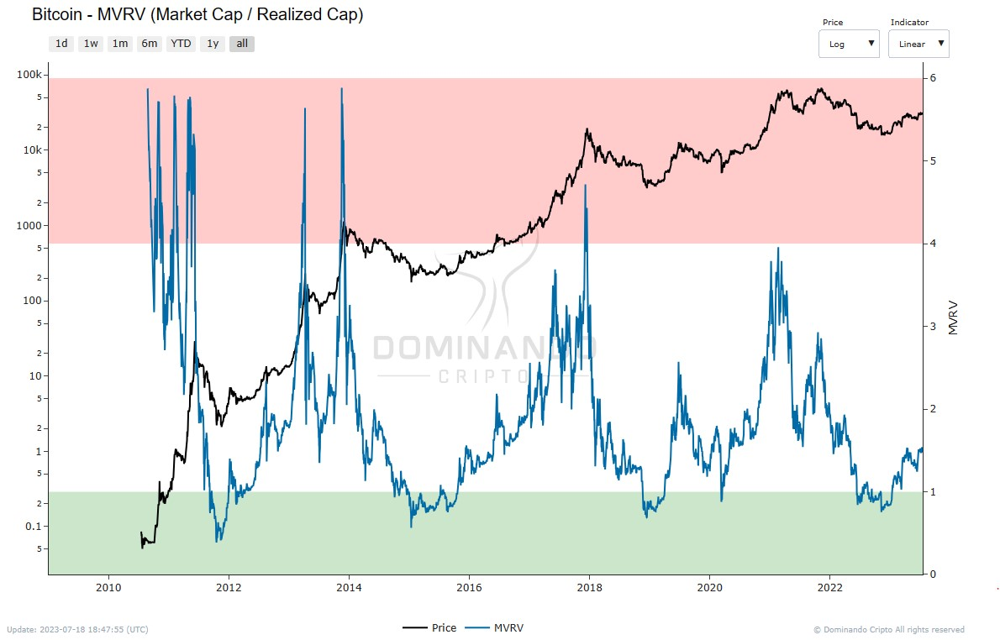

# MVRV

## What is it?

The MVRV (Market Value to Realized Value Ratio) is a metric used to evaluate the relationship between the market capitalization and the realized capitalization of an asset. This ratio is obtained by dividing the asset's market capitalization by the realized capitalization.

This metric is valuable for determining whether the price of an asset is fair or not, as well as being useful for identifying possible market tops and bottoms.

## How is it calculated?

The MVRV calculation takes into account both market capitalization and realized capitalization, making it a critical tool in
making investment decisions.

  

<h2>$\Large{MVRV} = \frac{Market\space Value}{Realized\space Value}$</h2>

## How to use?

MVRV can provide insight into selling pressure in the market. If market capitalization growth exceeds realized capitalization, MVRV values increase, which indicates a possible reason to sell the market, resulting in increased selling pressure. On the other hand, if the MVRV decreases, it indicates that the realized capitalization is surpassing the market capitalization, which suggests a decrease in selling pressure.

The metric is also a tool for studying the aggregate behavior of investors, as it shows how price moves in relation to investors' cost base. It works as a mean reversion model, where the realized capitalization is considered the average, and the MVRV measures the variations in relation to this average.

The MVRV signals are clear and leave no room for ambiguity. High values indicate a large amount of unrealized profit across the market, which increases the likelihood that investors will start distributing their coins, resulting in greater supply in the market. Extremely high values, historically above 4, can be bearish signals and indicate possible cycle tops.

On the other hand, low MVRV values suggest that the asset price has fallen below the aggregate cost base by a large margin, indicating that investors are holding low unrealized profits and/or facing large unrealized losses. This can make investors more likely to capitulate, which suggests the asset may be historically undervalued. MVRV below 1.0 has historically indicated bear market bottoms and accumulations of smart money in play.

In summary, MVRV is an important metric for investors to assess market health, identify potential tops and bottoms, and make informed decisions regarding their investment positions.

  

<figcaption align="center" style={{ fontSize: "12px", color: "#B0B0B0 " }}>
  Fig.1 - MVRV
</figcaption>
