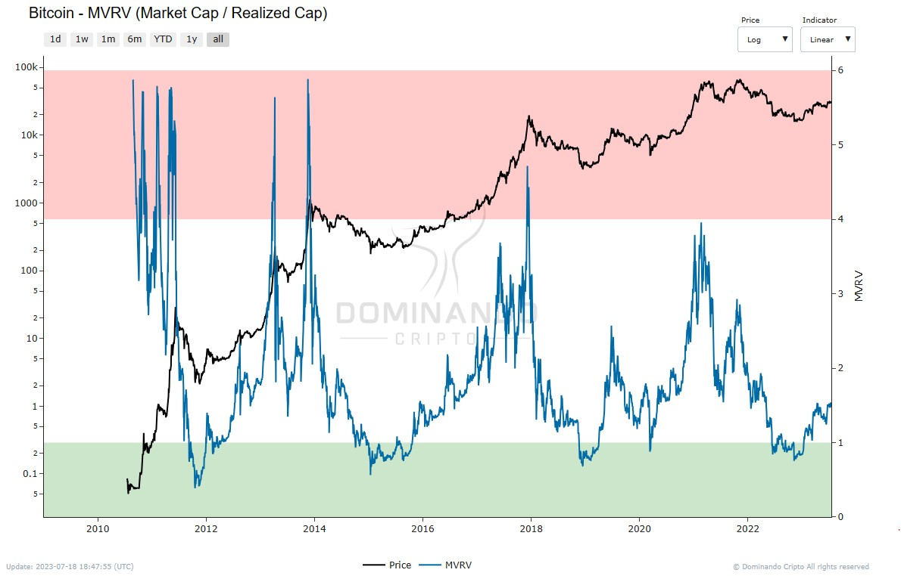

## MVRV

##### O que é?

O MVRV (Relação Valor de Mercado para Valor Realizado) é uma métrica utilizada para avaliar a relação entre a capitalização de mercado e a capitalização realizada de um ativo. Essa relação é obtida ao dividir a capitalização de mercado do ativo pela capitalização realizada.

Essa métrica é valiosa para determinar se o preço de um ativo está justo ou não, além de ser útil para identificar possíveis topos e fundos de mercado.

##### Como é calculado?

O cálculo do MVRV leva em consideração tanto a capitalização de mercado quanto a capitalização realizada, tornando-se uma ferramenta crítica na
tomada de decisões de investimento.

  

<h2>$\Large{MVRV} = \frac{Market\space Value}{Realized\space Value}$</h2>

##### Como usar?

O MVRV pode fornecer insights sobre a pressão de venda no mercado. Se o crescimento da capitalização de mercado supera a capitalização realizada, os valores do MVRV aumentam, o que indica um possível motivo para vender no mercado, resultando em uma maior pressão de venda. Por outro lado, se o MVRV diminui, indica que a capitalização realizada está superando a capitalização de mercado, o que sugere uma diminuição na pressão de venda.

A métrica também é uma ferramenta de estudo do comportamento agregado dos investidores, pois mostra como o preço se movimenta em relação à base de custo dos investidores. Funciona como um modelo de reversão à média, onde a capitalização realizada é considerada a média, e o MVRV mede as variações em relação a essa média.

Os sinais do MVRV são claros e não deixam espaço para ambiguidade. Valores elevados indicam uma grande margem de lucratividade não realizada em todo o mercado, o que aumenta a probabilidade de os investidores começarem a distribuir suas moedas, resultando em uma maior oferta no mercado. Valores extremamente altos, historicamente acima de 4, podem ser sinais de baixa e indicar possíveis topos de ciclo.

Por outro lado, valores baixos do MVRV sugerem que o preço do ativo caiu abaixo da base agregada de custo em uma grande margem, indicando que os investidores estão retendo lucros não realizados baixos e/ou enfrentando grandes perdas não realizadas. Isso pode aumentar a probabilidade de os investidores capitularem, o que sugere que o ativo pode estar historicamente subvalorizado. MVRV abaixo de 1.0, historicamente, indicou fundos de mercado de baixa e acúmulos de dinheiro inteligente em jogo.

Em resumo, o MVRV é uma métrica importante para os investidores avaliarem a saúde do mercado, identificar possíveis topos e fundos, e tomar decisões informadas em relação a suas posições de investimento.

  

<figcaption align="center" style={{ fontSize: "12px", color: "#B0B0B0 " }}>
  Fig.1 - MVRV
</figcaption>
