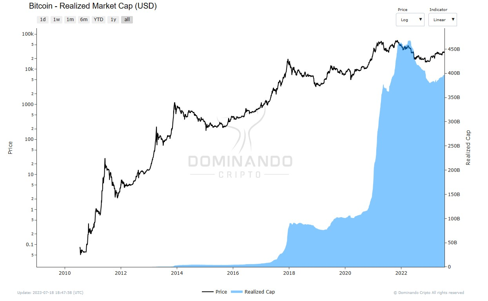

# Realized Capitalization

## What is it?

Realized Capitalization is a variation of market capitalization that assigns a value to each coin based on the price when it was last moved. Unlike conventional market capitalization, which uses the current price, realized capitalization represents the realized value of all coins on the network, rather than their market value.

## How is it calculated?

Realized Capitalization is calculated by assigning a value to each UTXO based on the price when it was last moved. This means that each coin is valued at the price it had at the time of your last transaction. By using this method, realized capitalization reduces the impact of lost or inactive coins for long periods by weighting coins according to their actual presence in the chain's economy.

When a coin that was last moved at significantly lower prices is spent, it will be revalued at the current price, thus increasing the realized capitalization by a corresponding amount. Likewise, if a coin is spent at a lower price than when it was last moved, it will revalue at a lower price and have a corresponding decrease in realized capitalization.

  

<h2>$\Large{Realized\space Cap} = \normalsize value \times {price_{created}[USD]\space (of\space all\space UTXOS)}$</h2>

## How to use?

Realized Capitalization is a powerful metric for estimating the real economic weight or global wealth stored in an asset. It disregards lost or inactive coins, considering them of low economic value. If these coins are spent after many years of inactivity, there will be a correspondingly large impact on realized capitalization, as they will be priced again in an active state.

This metric can be considered an estimate of the aggregated cost base for the network, making it a powerful benchmark for creating other metrics such as Realized Profit and Realized Value.

A practical example of application of Realized Capitalization is in relation to the cryptocurrency market. When comparing it with conventional market capitalization, we can observe several market phases:

- When market capitalization is above realized capitalization, the market is in aggregate profit.
- When the market capitalization is below the realized capitalization, the market is in aggregate loss.

Additionally, the trend and slope of realized capitalization can provide insight into the market phase:

- Bull markets tend to be characterized by a steep slope of realized capitalization, indicating that currencies bought at lower prices are being spent to take profits.

- Bear markets tend to be characterized by a smooth slope of realized capitalization.

In summary, Realized Capitalization is a valuable tool to better understand the actual value stored in an asset and to gain insights into market dynamics, especially in relation to market cycles and changes in the distribution of capitalization among different groups of holders. It can be used in conjunction with other metrics for a more comprehensive analysis of the cryptocurrency market and economy.

  

<figcaption align="center" style={{ fontSize: "12px", color: "#B0B0B0 " }}>
  Fig.1 - Realized Capitalization (USD)
</figcaption>
