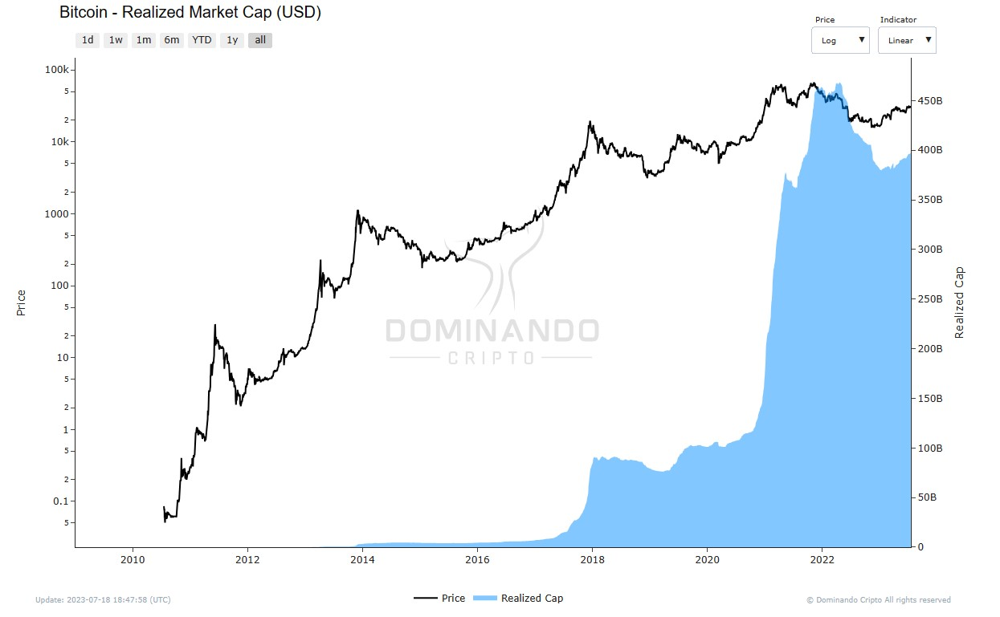

## Realized Capitalization

##### O que é?

A Realized Capitalization (capitalização realizada) é uma variação da capitalização de mercado que atribui um valor a cada moeda com base no preço da última vez em que foi movida. Diferentemente da capitalização de mercado convencional, que utiliza o preço atual, a capitalização realizada representa o valor realizado de todas as moedas na rede, em vez do seu valor de mercado.

##### Como é calculada?

A Realized Capitalization é calculada atribuindo um valor a cada UTXO com base no preço quando ele foi movido pela última vez. Isso significa que cada moeda é avaliada de acordo com o preço que tinha no momento de sua última transação. Ao utilizar esse método, a capitalização realizada reduz o impacto de moedas perdidas ou inativas por longos períodos, ponderando as moedas de acordo com sua presença real na economia da cadeia.

Quando uma moeda que foi movida pela última vez a preços significativamente mais baixos é gasta, ela será reavaliada ao preço atual, aumentando assim a capitalização realizada em uma quantidade correspondente. Da mesma forma, se uma moeda é gasta a um preço menor do que quando foi movida pela última vez, ela será reavaliada a um preço mais baixo e terá uma diminuição correspondente na capitalização realizada.

  

<h2>$\Large{Realized\space Cap} = \normalsize value \times {price_{created}[USD]\space (of\space all\space UTXOS)}$</h2>

##### Como usar?

A Realized Capitalization é uma métrica poderosa para estimar o peso econômico real ou a riqueza global armazenada em um ativo. Ela desconsidera moedas perdidas ou inativas, considerando-as de baixo valor econômico. Se essas moedas forem gastas após muitos anos de inatividade, haverá um grande impacto correspondente na capitalização realizada, pois elas serão precificadas novamente em um estado ativo.

Essa métrica pode ser considerada uma estimativa da base de custo agregada para a rede, tornando-se uma poderosa referência para a criação de outras métricas, como o Lucro Realizado e o Valor Realizado.

Um exemplo prático de aplicação da Realized Capitalization é em relação ao mercado de criptomoedas. Ao compará-la com a capitalização de mercado convencional, podemos observar várias fases de mercado:

- Quando a capitalização de mercado está acima da capitalização realizada, o mercado está em lucro agregado.
- Quando a capitalização de mercado está abaixo da capitalização realizada, o mercado está em perda agregada.

Além disso, a tendência e a inclinação da capitalização realizada podem fornecer insights sobre a fase do mercado:

- Mercados em alta tendem a ser caracterizados por uma inclinação acentuada da capitalização realizada, indicando que moedas compradas a preços mais baixos estão sendo gastas para realizar lucros.

- Mercados em baixa tendem a ser caracterizados por uma inclinação suave da capitalização realizada.

Em resumo, a Realized Capitalization é uma ferramenta valiosa para compreender melhor o valor efetivo armazenado em um ativo e para obter insights sobre a dinâmica do mercado, especialmente em relação a ciclos de mercado e mudanças na distribuição de capitalização entre diferentes grupos de detentores. Ela pode ser utilizada em conjunto com outras métricas para uma análise mais abrangente do mercado e da economia das criptomoedas.

  

<figcaption align="center" style={{ fontSize: "12px", color: "#B0B0B0 " }}>
  Fig.1 - Capitalização Realizada (USD)
</figcaption>
