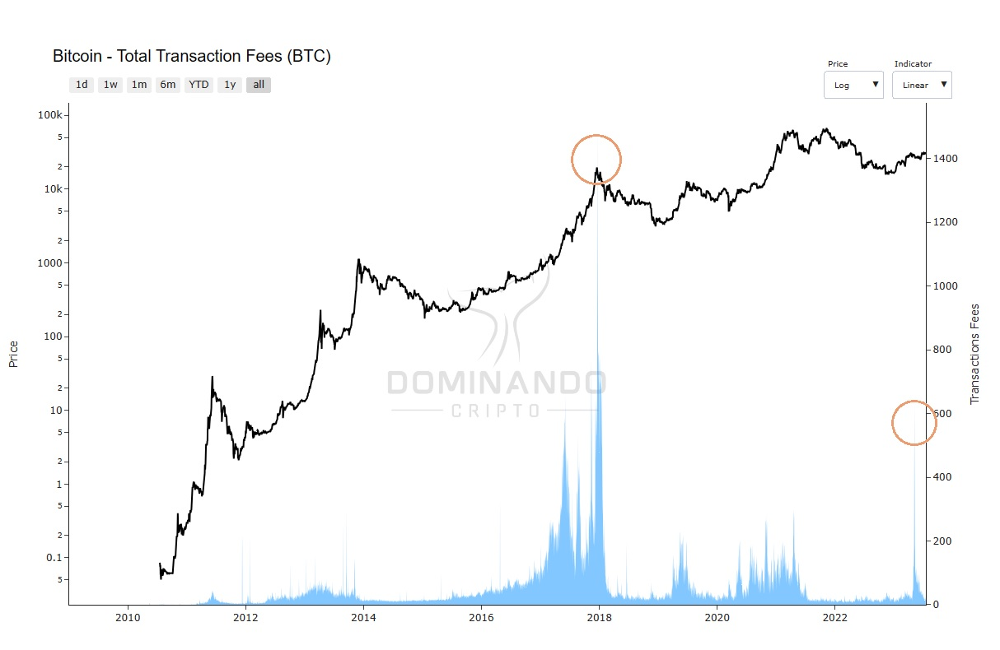

# Transaction Fee

The total transaction fee represents the amount of fees paid by users who wish to include a transaction in the blockchain, these fees being intended for miners as a form of reward for the work of verifying and including transactions in the network.

## What is it?

A transaction fee is an amount that users pay to have their transactions processed by miners and added to the blockchain. This fee is a reward for the services provided by miners, who dedicate computing power to verify and validate transactions. In essence, it is an incentive for miners to continue keeping the network secure and efficient.

## How to calculate?

The calculation of the transaction fee can vary depending on the blockchain used. In general, the fee is determined based on the amount of data the transaction occupies in the block as well as the current demand for the network. In periods of high demand and congestion, fees tend to increase so that transactions are processed faster. Conversely, in times of lower activity, fees often decrease.

## How to use?

To utilize the transaction fee appropriately, users should consider the urgency of the transaction. Se a velocidade de confirmação é crucial, é recomendável definir uma taxa mais alta para atrair a atenção dos mineradores. On the other hand, if there is no rush, one can opt for a lower fee and expect the transaction to be processed at times of lower network activity.

When transaction fees usually increase:
There are two specific times when transaction fees usually increase:

Bull Market:
During periods of bull market, when there is higher user participation in the network, the network can become congested. This scenario generates greater competition among users to get their transactions included faster. Como resultado, as taxas de transação tendem a aumentar. Por outro lado, as taxas de transação costumam diminuir em períodos de menor atividade na rede.

Extreme network utilisation:
Transaction fees also increase at times of intense network utilisation. For example, the launch of large collections of NFTs (Non-Fungible Tokens) can lead to high demand for the inclusion of transactions on the blockchain. This significant increase in activity can be seen in the chart below, as was the case with the May 2023 peak when the "Ordinals" NFT collection was launched on the Bitcoin network.

  

<figcaption align="center" style={{ fontSize: "12px", color: "#B0B0B0 " }}>
  Fig.1 - Transaction Fees (BTC)
</figcaption>
  
In the image above, it is possible to visualize two significant peaks in transaction
rates. The first peak occurred in September 2017, driven by the market surge. The
second peak was a result of the high demand for transactions related to the "Ordinals"
NFT collection, launched on the Bitcoin network in May 2023.
