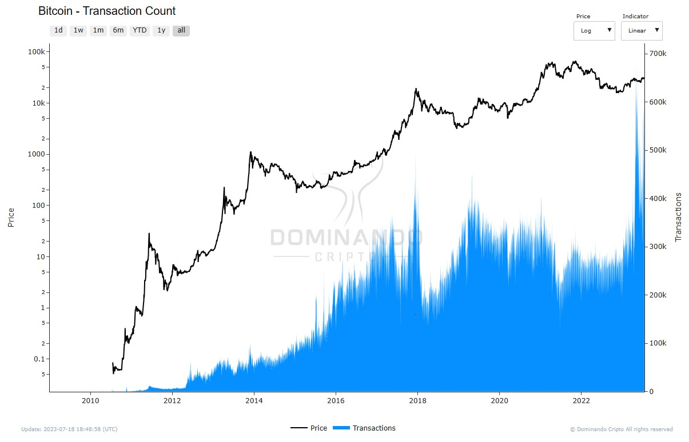

## Número de transações

#### O que é?

O número de transações é uma métrica importante dentro do ecossistema das criptomoedas. As transações representam um conjunto de ações planejadas para alterar o estado da blockchain iniciadas por um usuário. De forma simples, uma transação - que pode ser realizada por um humano ou máquina - altera as informações sobre "quem possui quais quantidades de criptomoedas" em uma blockchain.

#### Como é calculado?

O cálculo do número de transações é relativamente simples. Cada vez que uma transação é enviada para a rede, ela é registrada e adicionada à contagem total. Isso inclui todas as transações, sejam elas de envio ou recebimento de criptomoedas, bem como transações mais complexas, como contratos inteligentes.

#### Como usar o número de transações como métrica?

O número de transações é uma métrica valiosa para medir a atividade geral em uma rede de criptomoeda específica. Um aumento no número de transações pode ser um indicativo de maior interesse e adoção da moeda, bem como uma crescente atividade econômica no ecossistema. Por outro lado, uma diminuição no número de transações pode sugerir uma possível desaceleração ou falta de interesse na moeda.

É importante ressaltar que o número de transações pode ser afetado por práticas maliciosas, como a criação de robôs ou bots que realizam um grande número de transações artificiais para manipular essa métrica. Esse tipo de manipulação pode distorcer a percepção da atividade real na rede.

Portanto, ao analisar o número de transações, é essencial considerar outros indicadores e fatores, bem como utilizar outras métricas adicionais para obter uma visão mais abrangente do desempenho e adoção de uma criptomoeda. O contexto e a compreensão completa do ecossistema são cruciais para uma interpretação precisa e informada das métricas relacionadas às transações em criptomoedas.

<figcaption align="center" style={{ fontSize: "12px", color: "#B0B0B0 " }}>
  Fig.1 - Número de Transações
</figcaption>
